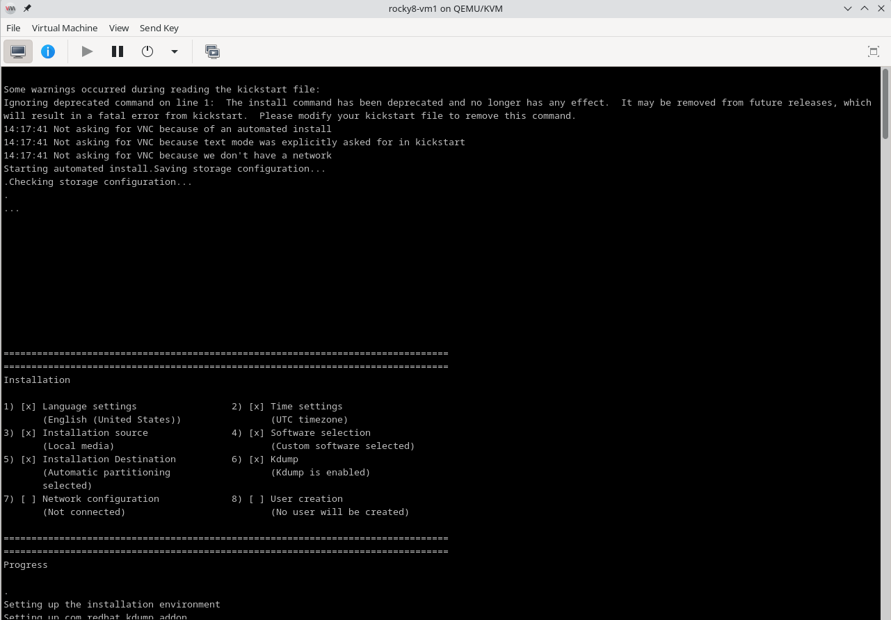

想在电脑上运行3个虚拟机，用于搭建kubernetes的学习环境，宿主机系统Arch
 Linux，采用KVM+QEMU+Libvirt。

KVM虚拟化CPU+内存；QEMU用于模拟硬盘、网卡等设备；Libvirt提供管理虚拟机的标准接口，包含一个libvirtd守护进程、工具行命令virsh，常使用图形化工具virt-manager搭配Libvirt。

> KVM支持: [KVM-Arch Linux维基](https://wiki.archlinuxcn.org/wiki/KVM)

> QEMU: [QEMU-Arch Linux维基](https://wiki.archlinuxcn.org/wiki/QEMU)

> Libvirt: [libvirt-Arch Linux维基](https://wiki.archlinuxcn.org/wiki/Libvirt)

-- ------------------------
### 目的
1.搭建三台安装rocky8的虚拟机

2.每台虚拟机互相之间可以通信

3.每台虚拟机可以与外网通信

4.宿主机可以访问每台虚拟机


通信直接使用libvirt默认会生成一个virbr网络设备，该设备提供NAT转发可以实现虚拟机访问外网（通过nftable实现），且连接到该设备上的虚拟机可以互相访问。


### 安装脚本
为了同时安装多台服务并配置IP，采用了Red Hat的kickstart自动化安装方法，如下：
```shell
#!/bin/env bash

set -Eeu
set -o pipefail

# 下载 ISO 文件（如果不存在）
ISO_URL="https://mirrors.aliyun.com/rockylinux/8/isos/x86_64/Rocky-8.10-x86_64-minimal.iso"
ISO_PATH="/var/lib/libvirt/images/Rocky-8.10-x86_64-minimal.iso"
MOUNT_DIR="/mnt/rocky8"

if [ ! -f "$ISO_PATH" ]; then
    echo "开始下载镜像文件..."
    curl -sS --create-dirs -o "${ISO_PATH}" "${ISO_URL}" 
fi

MOUNTED=false
# if ! mountpoint -q "$MOUNT_DIR"; then
#     sudo mkdir -p "$MOUNT_DIR"
#     sudo mount -o loop "$ISO_PATH" "$MOUNT_DIR"
#     MOUNTED=true
# fi

# IP地址设置 根据网桥的IP范围设置
VM_IPS=("192.168.122.2" "192.168.122.3" "192.168.122.4")
NETMASK="255.255.255.0"
GATEWAY="192.168.122.1"
DNS="8.8.8.8"

# 同时创建三个虚拟机
for i in {1..3}; do
    KS_PATH="/var/lib/libvirt/images/ks-rocky8-vm${i}.cfg"
    cat > $KS_PATH <<EOF
install
text
lang en_US.UTF-8
keyboard us
timezone UTC
rootpw 4471
bootloader --location=mbr --append="console=tty0 console=ttyS0,115200n8"
zerombr
clearpart --all --initlabel
autopart --type=lvm
network --bootproto=static --device=enp1s0 --hostname=rocky8-vm-${i} --ip=${VM_IPS[$((i-1))]} --netmask=${NETMASK} --gateway=${GATEWAY} --nameserver=${DNS}
firewall --disabled
selinux --disabled
services --disabled="firewalld"
reboot

%packages
%end

%post
%end
EOF

    # 设置不同MAC地址以避免冲突
    MAC=$(printf '52:54:00:%02x:%02x:%02x\n' $((RANDOM%256)) $((RANDOM%256)) $((RANDOM%256)))
    
    sudo virt-install \
        --name rocky8-vm${i} \
        --memory 2048 \
        --vcpus 2 --disk size=20,format=qcow2 \
        --network bridge=virbr0,mac=${MAC} \
        --os-variant rocky8 \
        --location "${ISO_PATH}" \
        --initrd-inject ${KS_PATH} \
        --extra-args "inst.ks=file:/ks-rocky8-vm${i}.cfg console=tty0 console=ttyS0,115200n8" \
        --graphics none \
        --console pty,target_type=serial \
        --noautoconsole
done

if [ "$MOUNTED" = ture ]; then
    echo "Unmounting ISO from $MOUNT_DIR..."
    sudo umount "$MOUNT_DIR"
fi

echo "Virtual machines are being created in the background..."
echo "Monitor installation progress with:"
echo "  sudo virsh console rocky8-vm1"

```
> 当virt-install没有加入--noautoconsole参数时，安装过程会莫名卡住，需要很长时间

- 自动安装界面
